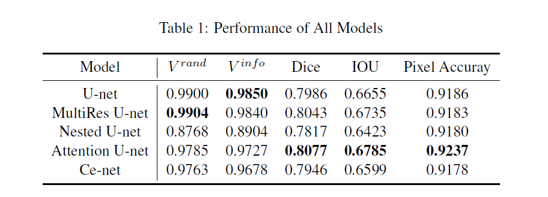
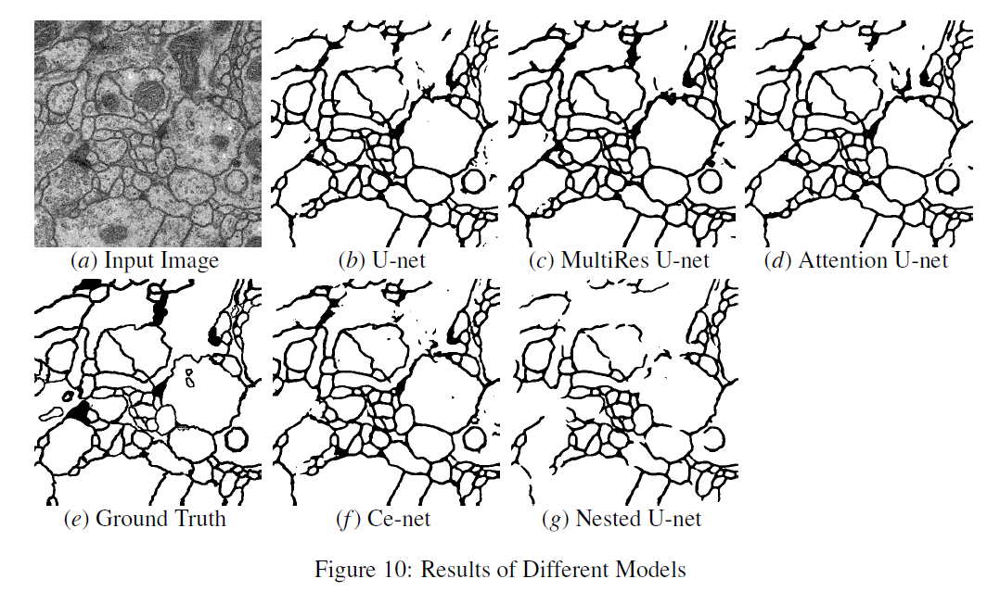

# Medical_Image_Segmentation
This repo is our team project for SJTU CS420. Generally speaking, this repo tries to do segementation for medical image.

## Environment Require
```
torch
torchvision
numpy
tqdm
imgaug
pillow
```

## Results




## How to add extra model

1. Add model in model directory
2. Register model in utils/get_model.py
3. Modify the parser in config/model_config.py and write your script train.sh predict.sh in /scripts
4. You need to modify parser in predict.py
